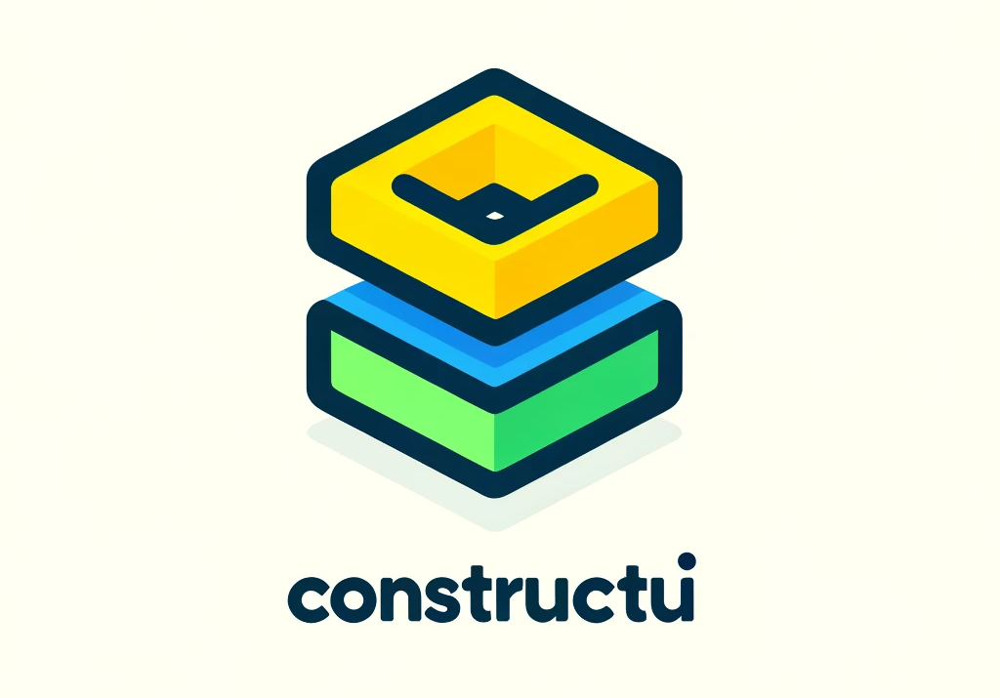

# Java-Js-ToDo-List

## Motivation

ConstructUI is a lightweight and straightforward library designed for developing web applications. It aims to simplify the process of building modern, responsive web applications by using a class-based approach to encapsulate HTML and CSS logic. ConstructUI addresses the common issues found in existing web frameworks, such as overly complex APIs and convoluted logic, by offering a simple, intuitive, and reusable set of building blocks.
## Prerequisites

Before you begin, ensure you have the following installed on your system:

- bun.js (version 1.1.8 or later)
- JDK (17 or later)

## Getting Started

Follow these steps to set up and run the project.

### 1. Install Dependencies

Navigate to the project directory and install the necessary dependencies:

- `bun install`

### 2. Compile the Frontend

Build the Java server and frontend application by running the following command:

- `bun run build`
- `bun run java`

This will create a production-ready build of the frontend in the \`dist\` directory.

### 3. Open the Application

1. Once the JAVA server is running, open your browser and navigate to:

   [http://localhost:3000/index.html](http://localhost:3000/index.html)

   You should see the To-Do list application running.

## Project Structure

Here is an overview of the project structure:

- `./server/Server.java` -> Java server
- `./src/main.ts` -> main file
- `./src/toDo` -> todo app dir
- `./src/components` -> all components for todo app
- `./dist` -> all build files

## Backend Options

### Using Java

Make sure your Java server is set up to serve static files
from the \`dist\` directory and handle the necessary API endpoints.

## Scripts

The following npm scripts are available:

- \`npm run java\`: Compile and Run java server and Compiles the frontend application.
- \`npm run build\`: compile src files without java and watch change.
- \`npm run clean\`: clean all compile files in dist.

## Contributing

Contributions are welcome! Feel free to open issues or submit pull requests.

## License

This project is licensed under the MIT License. See the [LICENSE](LICENSE) file for details.
